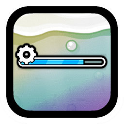

# [](https://www.geode-sdk.org/mods/cheeseworks.progressbarapi) Progress Bar API
For mods to easily create progress bars.

> [!WARNING]
> *This mod is no longer being maintained.*

---

> [](https://www.youtube.com/@cheese_works/) [](https://bsky.app/profile/cheeseworks.gay) [](https://dsc.gg/cubic)

> [](../../releases/) [](LICENSE.md)
>  
> [](https://www.geode-sdk.org/mods/cheeseworks.progressbarapi)

> [!NOTE]
> *This mod is an API for other mods to depend on.*

> [!TIP]
> *This mod has settings you can utilize to customize your experience.*

---

## About
This mod has an API that other mod developers can use to easily create customizable progress bars for their own purposes.

---

### API
Here's some basic information on the classes that this mod provides. You can find more information and code examples on the class and its fields & methods in the header file or README inside the API's folder.

#### `ProgressBar`
```cpp
static ProgressBar* create(); // Create the custom progress bar

void setProgressBarFillColor(ccColor3B color); // Set the color of the fill of the bar
void updateProgress(float value); // Update the fill of the bar

float getProgress(); // Get the current progress of the bar
```

---

### Changelog
###### What's new?!
**[📜 View the latest updates and patches](./changelog.md)**

### Issues
###### What's wrong?!
**[⚠️ Report a problem with the mod](../../issues/)**

### Development
###### Work with the mod directly.
**[⌨️ Check the API out](./incl/)**