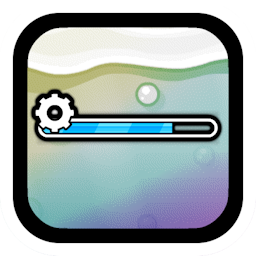

# [](https://www.geode-sdk.org/mods/cheeseworks.progressbarapi) Progress Bar API
For mods to easily create progress bars.

---

### Development
You can access the progress bar node class by including the [`ProgressBar.hpp`](ProgressBar.hpp) file in your code.
```cpp
#include <cheeseworks.progressbarapi/incl/ProgressBar.hpp>
```

Here's some sample code to create a progress bar in-game.
```cpp
class $modify(MyPlayLayer, PlayLayer) {
    bool init() {
        if (!PlayLayer::init()) return false;

        // Create a shiny brand new progress bar
        auto myBar = ProgressBar::create();
        myBar->setID("my-progress-bar"_spr);
        myBar->setProgressBarFillColor({ 100, 255, 125 });
        myBar->setPosition({ 200.f, 125.f });

        this->addChild(myBar);
    };
};
```

> [!NOTE]
> The **`ProgressBar`** class inherits directly from `CCNode`, allowing you to easily integrate it to the game's UI.

Best practice is to save the progress bar node into a field in the class you're creating or modifying to work with it directly in other parts of its parent class.
```cpp
class $modify(MyPlayLayer, PlayLayer) {
    struct Fields {
        ProgressBar* m_myBar = nullptr;
    };

    bool init() {
        if (!PlayLayer::init()) return false;

        // Assign a new progress bar
        m_fields->m_myBar = ProgressBar::create();
        m_fields->m_myBar->setID("my-progress-bar"_spr);
        m_fields->m_myBar->setProgressBarFillColor({ 100, 255, 125 });
        m_fields->m_myBar->setPosition({ 200.f, 125.f });

        this->addChild(m_fields->m_myBar);
    };

    void updateProgressbar() {
        if (m_fields->m_myBar) { // Make sure it's valid
            auto percent = this->getCurrentPercent();
            m_fields->m_myBar->updateProgress(percent);
        };

        PlayLayer::updateProgressbar();
    };
};
```

Happy modding!

---

### Users
###### Regular users of this mod.
**[📱 Learn about this mod](../)**